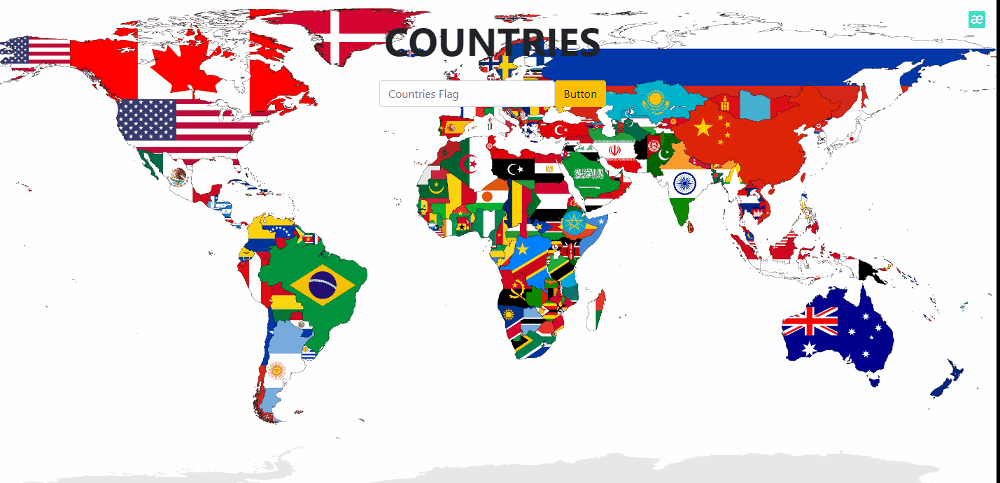

[Click](https://ilkaybasboga.github.io/hw-js-Flag/)
# Project-Coutry&Flag

## Description
In the project, I aim to create a Country Information website.


## Project Skeleton 

```
HW-JS-FLAG (folder)
|----img
      |----3.png
|----readme.md    
|----style.css
|----index.html  
|----js
      |----app.js
```

## Expected Outcome




### At the end of the project, I will learn the following topics;

- HTML 

- JavaScript

- API

- Bootstrap-CSS 

## Steps to Solution

- Step 1:HTML Built with Bootstrap-CSS.

- Step 2: Retrieve country information using API data.

- Step 3: -The result was obtained with the JS algorithm.


<center> ⌛ Happy Coding  ✍ </center>

